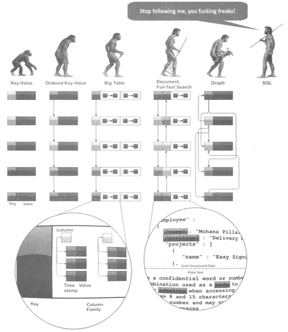
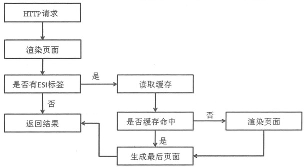
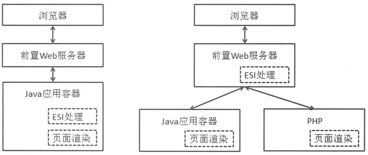
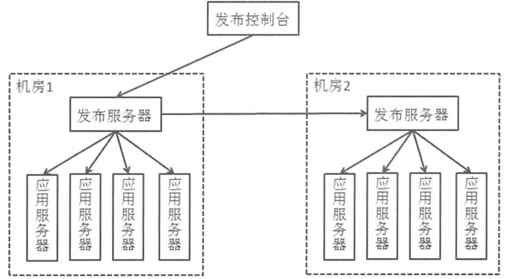
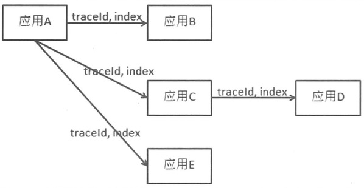

## 概论

+ 阿姆达定律（Amdahl），用于评估程序在多核服务器上的处理速度提升比：S(N) = 1 / ((1-P) + P / N)，其中P指程序中**可并行部分在单核上执行时间的占比**，N表示处理器的个数（总核数）。S(N)表示程序在N个处理器上相对于单核中的速度提升比。
+ 对于数据容器，如果读写比例较高，可以采用读写锁加锁，相比简单的互斥锁可以提供更高的性能。
+ 线程模式：

<blockquote>
1. 互相没有通信的模式
2. 共享数据容器的模式，java.util.concurrent包中的并发容器类均可提供此类用途。
3. 使用事件协同的模式，java.util.concurrent包中的AbstractQueue、Lock等提供此类用途。
</blockquote>

+ 典型多线程死锁场景及其解决方式：

<blockquote>
两个锁A和B，两个线程T1和T2，死锁场景：

T1:
    A.lock();
    B.lock();
    
T2:
    B.lock();
    A.lock();

解决方式1:

T1:
    A.lock();
    B.lock();
    
T2:
    A.lock();
    B.lock();

保持不同线程获取多个锁的顺序一致。

解决方式2:

T1:
    getLocks(A, B);
    
T2:
    getLocks(A, B);
    
一次获取所需的所有锁对象，如Windows平台提供了WaitForMultipleObjects。或则也可以用另外一个锁C等价表示同时获得A和B。
</blockquote>

+ 多进程和多线程的两点主要区别：

<blockquote>
1. 多进程比多线程的资源控制相对简单，因为进程空间是独立的。
2. 多进程中的单进程失效，有可能不会导致整体不可用。
</blockquote>

+ 网络IO三种实现方式：

<blockquote>
1. BIO 一个socket一个线程处理
2. NIO Reactor模式，采用select/poll机制，reactor线程处理并派发IO事件，业务线程（池）具体处理事件。
3. AIO Proactor模式，调用read/write需要同时传入CompleteHandler。
</blockquote>

+ 计算机由输入、输出、控制器、运算器、存储器5部分组成，分布式系统其实就相当于是一台**超级计算机**。

+ 分布式系统的控制器，主要用于协调不同节点间的动作和行为，如寻址等，主要有以下模式：

<blockquote>
1. 透明代理，如LVS，Nginx。请求发起方和处理方的的通信经过代理服务器。
2. 名称服务，如Zookeeper、DNS。请求发起方和处理方直连，通过名字服务感知对方。
3. 规则服务，名称服务的升级。通常用在对状态有高要求的场景，比如dubbo-admin中保存了所有服务provider的状态。这是与名称服务的关键区别。
</blockquote>

+ LVS的DR或TUN模式，【请求处理机】返回的结果会直接到【客户机】，而不经过LVS代理服务器。
+ 如果使用代理服务器，必须考虑**代理服务器的热备份**。否则，系统不可用风险太高。
+ 分布式系统的计算器，主要用于业务处理，由多个物理节点组成，依靠控制器协调。
+ 分布式系统的存储器，主要用于数据存储，有多个物理节点组成，依靠控制器协调。
+ 分布式系统的难点

<blockquote>
1. 统一的时钟
2. 故障的独立性，即通常都是有些节点正确，有些节点错误。
3. 避免单点故障，一种思路是单点备份，如双机热备；一种思路是降低单点影响范围，如分库。
4. 事务的挑战
</blockquote>

+ 应用服务器集群后的session问题及解决方案：

<blockquote>
1. session sticky，通过将负载均衡器变为有状态节点，保证同一个session可以被指向到同一个应用服务器节点。缺点负载均衡器有了应用层的状态信息，容灾麻烦；单台应用服务器宕机会导致用户重新登录。
2. session replication，多个应用服务器节点之间进行session数据同步，每台应用服务器都有一个全量session数据。缺点session数据的同步时延和网络开销；session数据的冗余存储消耗。
3. session cluser，单独的session存储服务器，可以使用数据库或者其他分布式存储系统。缺点引入了读写session的网络开销。
4. cookie based，将session信息保存在cookie中，缺点cookie的大小限制；安全性；性能和带宽。
</blockquote>

+ 读写层优化方案

<blockquote>
1. DB读写分离
    1.1 数据复制延迟
    1.2 应用程序对目标数据库的选择
2. 搜索引擎（可以看做另一种读库）
    2.1 索引更新：定时、实时
    2.2 索引更新：全量、增量
3. 缓存
    3.1 缓存命中率是关键指标
    3.2 缓存服务器扩容或缩容必须平滑，如一致性hash
    3.3 缓存更新模式：Write Aside、Read Through、Write Through、Write Behind Caching
</blockquote>

+ 分布式存储系统：

<blockquote>
1. 分布式文件，解决小文件和大文件的存储
2. 分布式k-v数据库，解决半结构化数据高性能查询
3. 分布式关系数据库，提供高并发、大数据数据库系统
</blockquote>

+ 分库分表：

<blockquote>
1. 垂直拆分
    1.1 事务：分布式事务、放弃强事务
    1.2 慎用表连接查询
    1.3 主键约束，不能简单实用单库机制，如自增字段等
2. 水平拆分
    2.1 分片算法，字段选择、Hash算法
    2.2 主键约束，不能简单实用单库机制，如自增字段等
</blockquote>

+ 应用层拆分：

<blockquote>
1. 根据应用业务特性划分子系统
2. （微）服务化
</blockquote>

+ Java中间件的基础知识：

<blockquote>
1. JVM内存模型
2. Java同步机制，Synchronized、Volatile、Lock、Object#wait/notify(All)、CountDownLatch、CyclicBarrier、Semaphore
3. Java线程池
4. Java并发集合
5. Java动态代理，基于接口
6. 反射
7. JavaIO，BIO、NIO、AIO
</blockquote>

+ 网站架构演进视图：

<blockquote>
1. 应用拆分
2. 服务拆分
3. 数据拆分
4. 应用解耦
</blockquote>

+ 消息中间件还有一个常用的用途：间接完成事务。

+ 分布式服务框架（如Dubbo、ZK）解决应用拆分和服务拆分；分布式数据层中间件（框架）（如Cobar、ShardingJDBC、MySql Proxy）解决数据拆分；分布式消息中间件（如Kafka、RocketMQ）解决应用解耦。

## 服务框架

**基本讲述的就是Dubbo的设计细节**

+ 传统系统的架构：

```
应用A   应用B   应用C   应用D
-----------------------------
DB  缓存  分布式文件  搜索引擎
```

<blockquote>
困境：

1. 随着业务发展，每个应用逐渐变得复杂、臃肿、重复代码、冗余代码
2. 在原有的应用中增加新的功能，影响范围较大，影响研发效率和系统稳定性

解决：

1. 切分应用，提高应用粒度
2. 增加间接层，服务化
</blockquote>

+ 服务化架构：

```
应用A   应用B   应用C   应用D
-----------------------------
服务1   服务2   服务3    服务4
-----------------------------
DB 缓存 分布式系统 搜索引擎
```

<blockquote>
解决：

1. 通过应用抽象共有服务，不断抽取各个应用的冗余功能，向下沉淀。
2. 应用层面向用户场景，服务层面向应用层；应用层面向业务功能，服务层面向业务数据。
3. 纵向分离关注点，不同的人或团队分别负责应用层和服务层。
4. 功能单一内聚的服务，可以组合被新应用使用，提高新应用研发效率。
</blockquote>

+ 服务路由：基于接口、基于方法、基于参数、或者前三者的组合。

+ 服务调用流控：1. 0-1开关；2. 基于每秒请求数。

+ 服务调用流控维度：1. 基于调用的服务签名（接口、方法、参数）；2. 基于调用方（应用A、应用B）

+ 服务协议的两个部分：1. 通信协议，基于tcp、udp的自定义协议；2. 远程过程调用协议，如json、xml。协议应该具有版本号，以支持未来可能的扩展。

+ 异步调用方式：

<blockquote>
1. Callback 回调可能在IO线程，也可以在单端的回调线程执行。
2. Future 在原调用线程中。
3. 可靠异步，保证异步消息一定在远程执行，一般通过消息中间件实现。
</blockquote>

+ 服务升级：

```
1. 接口不变，只改内部实现。可以灰度发布。
2. 修改原有接口
    2.1 增加方法
    2.2 修改方法签名，通过新增重载的新签名方法，通过版本号解决兼容。
```

+ 采用合适的服务框架是系统向服务化演进的先决条件，如dubbo、spring boot或自建。

+ 服务化的权衡点：

```
1. 服务划分 
    1.1 根据数据抽象服务
    1.2 根据应用抽象服务
    1.3 根据服务抽象服务
2. 服务粒度
3. 请求合并
```

+ 服务治理是在采用服务框架后，为服务化保驾护航的功能集合：

```
1. 管理服务（写）
    1.1 服务上下线
    1.2 服务路由
    1.3 服务限流降级
    1.4 服务归组
    1.5 服务线程池管理
    1.6 机房规则
    1.7 服务授权
2. 查看服务（读）
    2.1 服务信息
        2.1.1 服务编码（数字化的唯一编码）
        2.1.2 编码定位服务
        2.1.3 编码注册
        2.1.4 元信息（接口、方法、参数、负责人、团队、发布时间、版本、地址列表、容量、质量、依赖）
    2.2 服务质量
        2.2.1 服务排行（TPS、RTS、出错率等）
        2.2.2 服务质量趋势
        2.2.3 各类查询条件支持
    2.3 服务容量
        2.3.1 当前容量与总容量
        2.3.2 历史趋势图
        2.3.3 各类查询条件支持
    2.4 服务依赖
        2.4.1 依赖视图
        2.4.2 被依赖视图
        2.4.3 依赖变化
    2.5 服务分布
        2.5.1 不同机房分布
        2.5.2 不同机柜分布
        2.5.3 分布不均衡服务列表
    2.6 服务统计
       2.6.1 调用次数与排名
       2.6.2 出错次数与排名
       2.6.3 出错率与排名
       2.6.4 响应时间与排名
       2.6.5 响应时间趋势
       2.6.6 出错率趋势
    2.7 服务查询
       2.7.1 各个维度服务的查询（负责人等等）
    2.8 服务监控
       2.8.1 关键数据采集、报警、
    2.9 服务报表
       2.9.1 各类定制报表及导出
```

+ 服务框架与ESB的对比：

<blockquote>
1. 服务框架是点对点模型；ESB是总线模型
2. 服务框架不是中间件；ESB是单独的中间件
3. 服务框架面向同构系统；ESB面向异构系统
</blockquote>

+ 数据层优化：

```
1. scale up 有上限，价格贵
2. scale out 
    2.1 应用优化
    2.2 缓存、搜索引擎，本质是读写分离
    2.3 分库分表，降低单库压力
```

+ 垂直拆分的影响:

<blockquote>
1. 单机ACID事务破坏
2. 连接查询（join）破坏
3. 外键约束可能失败
4. 存储过程、触发器
5. 跨库数据排序、函数聚合、平均值等等
</blockquote>

+ 水平拆分的影响

<blockquote>
1. 单机ACID事务破坏
2. 连接查询（join）破坏
3. 外键约束可能失败
4. 依赖DB的唯一自增ID受影响（ID需要考虑唯一性、连续性）
5. 逻辑单表查询可能跨库，导致查询复杂化
6. 存储过程、触发器
7. 跨库数据排序、函数聚合、平均值等等
</blockquote>

+ 分布式事务（2PC和3PC是分布式事务的实现算法）对于大多数应用场景来说，代价太大，主要是体现在几个方面：

```
1. 引入协调者，还必须保证协调者的高可用（无单点）
2. 由于参与节点的增多，同时需要保证事务的ACID特性，
   因此，原本在单机事务中的性能损耗（相比于非事务），会被急剧放大。
3. 回滚操作代价大

就第一点而言，在采用MQ保证最终一致性的方案中，仍然存在类似代价，
因此，其相比[2, 3]而言，其并非最关键的代价。
```

+ CAP

```
Consistency  
    强一致性，数据一旦写成功，所有节点会同时看到最新状态。
Availability 
    强可用性，无论成功或失败，每个请求都必须收到一个反馈。重点是系统一定要有响应。
Partition tolerance 
    系统的部分节点失效或者消息丢失，系统仍然可以继续运行（运行的意义是处理逻辑）。

CA: 就是传统单机数据库的选择，即事务，分布式事务也是如此，
CP: 可用性低。
AP: 放弃强一致性，大多数分布式系统的选择。

分布式事务牺牲P，保证CA：只要（事务的）任何一部分出错，整个系统就必须停止运行，否则就无法保证C。
```

+ 分布式系统中，一般选择AP，对于C（一致性），采用BASE模型解决：

```
Basically Available 基本可用，允许分区失败。
Soft State 软状态，接受一段时间的数据不同步。
Eventually Consistent 最终一致性，保证（各个节点）最终数据的状态是一致的。
```

+ Paxos是比2PC（和3PC）更轻量级的保证分布式一致性的协议，它保证的是最终一致性，非强一致性。其有一个基本前提是不存在拜占庭将军问题（就是网络不可信），即必须保证可信的通信环境（比如数据包不可篡改）。

+ Quorum算法是用来衡量分布式系统的可用性和一致性的：

```
N: 数据复制节点数量
W: 成功写操作的最小节点数
R: 成功读操作的最小节点数

如果W + R > N，则可以保证强一致性；如果W + R <= N，可以保证最终一致性。
```

+ Vector Clock算法的思想是通过对同一份数据的修改都加上v-clock，即`[<修改者, 版本号>, <修改者, 版本号> ...]`来解决一些冲突。

+ 分布式系统中ID的生成：

```
ID的两个维度：
    1. 唯一性，必须
    2. 连续性，可选 
    
ID生成方案：
    1. ID生成器中间件，ZK、Redis、自建等等。
    2. UUID，不连续。
```

+ 跨库Join解决：

```
1. 将Join转换为多次单库查询，对结果汇总处理
2. 数据冗余，需要根据具体场景
3. 借助外部系统，如搜索引擎等
```

+ 外键约束

```
由应用程序保证约束。
```

+ 跨库查询

```
1. 排序，多库数据归并排序
2. 函数处理，如MAX、求平均值，多库查询数据后归并处理
3. 非排序分页
    3.1 等步长分页，即每页数据中来自每个数据源数据量一样
    3.2 等比例分页，即每页数据中来自每个数据源的数据量，与各数据源数据比例一致
4. 排序分页（最复杂和难以处理的情况，尽量避免多DB源的排序分页）
    4.1 搜索引擎
    4.2 归并排序，需要在效率和准确性之间权衡。
```

+ 在分布式跨库查询结果的归并中，ORM具有如下缺点：

```
1. 多余的对象映射和生成
2. 必须在应用端聚合
```

+ 数据访问层的实现：

```
1. JAR，如tddl
    
2. Proxy 即中间件，如MySQL Proxy、MyCat、ShardingJDBC等
    2.1 自有协议
    2.2 数据库协议
```

+ 读写分离的数据复制方式：

```
1. 数据库binlog
2. 数据分发平台，支持将数据库变更到其他数据源，如缓存、搜索引擎等
```

+ 数据平滑迁移

```
1. 可停机迁移 简单
2. 不可停机迁移
    2.1 利用中间件不停机迁移，如Flume、Kafka、RocketMQ等
        保证迁移速度大于数据增量速度，通过两个速度的比值，可以估计迁移时间。
    2.2 利用中间件对新的增量数据双写；同时，对既有数据并行迁移。
```

## 消息中间件

+ MQ两个核心特点：

```
1. 应用解耦
2. 操作异步
```

+ MQ的衡量指标：

```
1. 消息顺序保证性
2. 可扩展性（分布式，不是单点）
3. 消息可靠性（内存or磁盘，保证消息不丢）
4. 群组订阅
```

+ 消息订阅方式：

```
1. 非持久订阅 订阅状态与消息订阅者状态相关
2. 持久订阅   订阅状态与消息订阅者状态相关
```

+ 保证消息可靠性：

```
1. 持久订阅 不会因消费者或MQ的宕机，导致消息订阅无效
2. 消息发送端可靠性保证 当且仅当MQ及时、明确返回成功，消息发送端才认为消息发送成功；
   其他情况，如返回错误、异常、超时等，均视为发送失败，需要重发。
3. MQ消息存储可靠性保证 必须存储在磁盘上
   3.1 基于文件 自建引擎 or 开源引擎
   3.2 基于关系数据库 
       3.2.1 库表设计 [消息表 + 投递表]
             缺点：投递消息表的数据量与[消息数 * 订阅者]成比例，数据量过大。
       3.2.2 库表设计 [消息表 + 投递字段]
             缺点: 无法方便地从订阅者维度对投递状态进行更新。投递字段长度限制。
       3.3.3 存储容灾 多机Replication，延迟问题。
       3.3.4 存储容灾 双写，复杂性。
   3.3 基于双机内存 并非完全安全，但性能高
   3.4 扩容 
       3.4.1 消息存储独立 存储扩容、调度器扩容（无状态，更易扩容）
       3.4.1 消息调度存储一体 趋势 RocketMQ、Kafka
4. 消息投递的可靠性保证 
   4.1 当且仅当消费端明确返回成功，MQ才认为消息接收成功。
   4.2 消费者不应该在消息的业务处理完成前返回接收成功响应。
```

+ 消息投递通常是多线程的，具体到单个投递线程，其实现方式有：

```
1. 阻塞式 投递后阻塞等待消费端返回
2. 非阻塞式 投递后不等待消费端返回，直接投递其他消息；启用单独的[投递状态更新线程]
   异步[及时/定时批量]更新。
   
其实和IO模型类似。
```

+ 单应用存在多个订阅者订阅相同topic的优化：

```
1. 共享socket连接。
2. 消息只发送一次，消费端增加一个dispatcher，负责将消息分发给不同订阅者。
```

+ 消息重复的产生和应对:

```
1. 生成端重试
   1.1 生成端发送到MQ后，MQ正常存储，随后MQ出现问题，没有响应给生成端。
   1.2 MQ负载过高，导致没能及时给生成端发送响应，导致超时。
   1.3 MQ存储消息后，网络问题导致没能发送响应，生成端重试时，网络又恢复。
   
解决方案：
   1.1 消费端重发时使用相同ID，即消息ID不在MQ生成，由客户端生成。
   1.2 分布式事务，在高可用、高并发的互联网应用没法实行。可以直接PASS。
   1.2 消息消费者对消息的处理操作保持幂等性。

2. MQ重复投递
   2.1 消费端接收消息，成功处理后，应用出现问题，没有给MQ发送响应
   2.2 消费端接收消息，成功处理后，网络出现问题，没有给MQ发送响应
   2.3 消费端接收消息，处理时间较长后，导致MQ等待响应超时
   2.4 消费端接收消息，成功处理后，发送响应给MQ，但此时MQ出现问题，
       没能处理响应
   2.5 消费端接收消息，成功处理后，发送响应给MQ，但此时消息存储错误，
       没有更新消息处理状态
       
解决方案：
   1.1 分布式事务，在高可用、高并发的互联网应用没法实行。可以直接PASS。
   1.2 消息消费者对消息的处理操作保持幂等性。
   1.2 消费端保存消息消费状态，并保证状态更新操作与消息处理操作是一个
       本地事务。
   
应对思路：
   1. 消除重发行为（如生成端重试和MQ重复投递）
      总的思路： [消息唯一ID] + [消息(投递或消费)状态表] + [多个本地事务]
   2. 消除重复行为的副作用，即保持消息处理方的操作幂等性。
```

+ 操作幂等性

```
对单个写操作而言，保持幂等性的一个常用做法是CAS（Compare And Set），比如：

幂等：  update table set m = 10 where id = 1 and m = 15;
非幂等：update table set m = m + 10 where id = 1;

CAS带来一个问题：原值从哪里来？如果完全从客户端来，那么又涉及对客户端数据的
信任问题。

对具体的业务操作（可能包含多个写相互关联的写操作）而言，需要具体分析如何实现
幂等性。并且并非所有操作都可以转换为幂等性。
```

+ MQ单机多队列（topic）的优化：

```
MQ单机中的物理队列过多会导致“随机写”，性能急剧下降。

解决方式：

将队列分为“物理队列”和“逻辑队列”，其中物理队列“顺序写”实际的消息，而逻辑队列
是“被订阅的队列”。逻辑队列相当于是一个“数据（存储在物理队列）索引队列”。但这
种方法，会导致另外的问题：

1. 读消息时，会先读逻辑队列，再读物理队列，多了一次开销。
2. 编程复杂性
3. 读变成了完全随机读

对上述三个问题，可以进行如下优化：

1. 增大内存，尽量让读命中Page Cache
2. 系统IO调度方式设置为NOOP，会在一定程度上将随机读转换为顺序跳读。
3. 物理队列中保存元信息，即使逻辑队列丢失，仍然可以通过物理队列恢复。
```

+ MQ的PUSH和PULL模式对比：

||PUSH|PULL|
|--|--|--|
|传输状态|保存在MQ端|保存在消费端|
|实时性|非常高|短轮询取决于轮询时间，长轮询与PUSH一致|
|传输重试|MQ维护传输状态，失败重试|不需要|
|流控机制|MQ端依据订阅者消费能力推送|消费端根据自身能力决定|

<blockquote>
**长轮询**

基本思想是在每次客户端发出请求后，服务器检查上次返回的数据与此次请求时的数据之间是否有更新，如果有更新则返回新数据并结束此次连接，否则服务器“hold”住此次连接，直到有新数据时再返回相应。服务端关闭连接后，客户端一般会立即再重新发起请求。而这种长时间的保持连接可以通过设置一个较大的timeout实现。

相比**短轮询**，其实时性更好，并且不会给服务器端无谓的Pull请求负担。
相比**长连接**，其更适用于消息频率不是很高（频率太高会产生过多的释放/重建连接的开销），但实时性要求较高的场景。
</blockquote>

## 软负载和集中配置管理

+ 软负载的两个基本功能: 

```
注意此处的软负载，更准确的说是[寻址型软负载]，不是[代理型软负载]。

1. 地址聚合
2. 生命周期感知
```

## 大型网站的其他技术

+ CDN 把相对稳定的内容放到离用户更近的机房中。

```
CDN关键技术：

1. 全局调度 根据用户地域、接入运营商、CDN机房负载将资源请求调度到合理的CDN机房。
2. 缓存技术 内存 + SSD + 磁盘，没有请求时，主动加载新增、更新的资源或数据。
3. 内容分发 将资源或数据分发到相关的CDN节点。
4. 带宽优化 压缩算法、只返回必要的资源数据
```

+ 存储技术：



+ HBase是Google BigTable的开源实现，数据是通过HRegionServer来管理的，每个HRegionServer中管理了多个HRegion，每个HRegion中管理具体数据。而HMaster负责管理所有的HRegionServer。

+ Amazon的Dynamo与HBase不一样，是通过一致性哈希来管理数据分布的，而非中心Master（比如HMaster）。Cassandra是其一个开源实现。

+ 大型网站应用使用缓存的两个重要场景：1. 作为数据存储层的中间缓冲层；2. WEB页面渲染的缓存。

+ ESI(Edge Side Include)技术是对WEB界面进行缓存的技术，其基本原理是：将页面分为若干个动态块和静态块，其中静态块加入特殊标签，进行缓存和读取。



+ ESI标签处理可以放在两个地方：1. WEB前置容器；2. 后端Java容器



+ 随着系统越来越大，单纯依赖Like进行检索的方式就会极大限制系统发展，因此，必须构建站内搜索系统。而对于站内搜索而言，进入系统的数据更新属性、来源、格式都是已知的，因此，其为索引更新提供了极大便利，主要方式如下：

<blockquote>
1. 定时从数据源获取，称之为增量Dump，这需要数据必须有字段记录变更时间，而且该字段必须有索引，否则效率会很低。增量Dump开始前，需要有全量Dump构造初始化索引数据，增量Dump的频率一般为几分钟，因此会有明显的时延。
2. 通过数据变更的通知，及时通知搜索引擎构建索引，及时性较高，但系统压力也会变大，因此，更适合实时性较高的场景。
</blockquote>

+ 正排索引
|||
|---|-----|
|doc1|key1, key2, key3|
|doc2|key1|
|doc3|key2, key3|


+ 倒排索引

|key1|doc1, doc2|
|key2|doc1, doc3|
|key3|doc1, doc3|

<blockquote>
倒排索引是搜索引擎的关键技术，需要基于分词构建倒排索引。
</blockquote>

+ 数据计算

```
- 离线计算

1. Hadoop 基于磁盘，数据存储在HDFS
2. Spark 基于内存

- 实时计算

1. Storm 基于内存
2. Yahoo S4
```

+ 发布系统

```
1. 分发应用 可以采用P2P技术加快分发速度
2. 启动校验 系统提供页面或检测脚本，由发布系统调用
3. 灰度发布 将系统一定比例（20%)的流量导入新发布的应用，观察验证
```



+ 应用监控

```
1. 数据监视维度
   1.1 系统环境信息 CPU、IO使用率、网络带宽等
   1.2 应用自身数据 调用频率、响应时间
2. 数据采集方式
   2.1 应用服务器推
   2.2 采集服务器拉
```

+ 依赖管理 分布式应用内部各个子服务（应用）之间的依赖情况

```
分布式应用请求调用链

1. Google Dapper
2. 阿里鹰眼

必须有一个全局的TraceID，需要在跨系统调用时进行传递。一般还需要一个index变量，用于记录依赖的层级（深度）。
```



+ 

